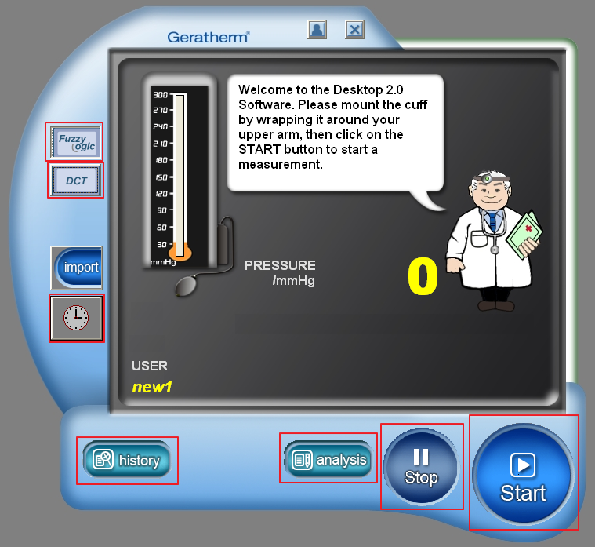
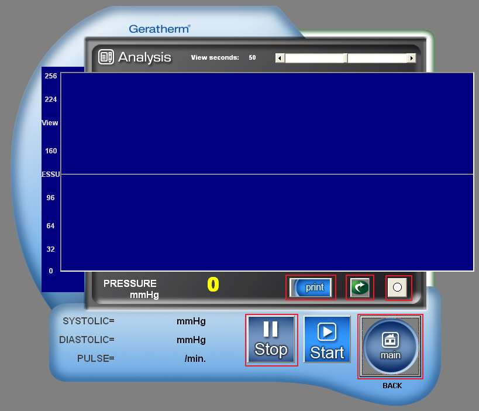
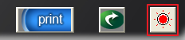

<!-- TOC -->

- [圖片需求](#圖片需求)
  - [背景圖](#背景圖)
    - [測量背景圖](#測量背景圖)
    - [歷史紀錄背景圖](#歷史紀錄背景圖)
    - [分析頁背景圖](#分析頁背景圖)
  - [ICON](#icon)
    - [BP Monitor](#bp-monitor)
    - [Computer](#computer)
  - [按鈕](#按鈕)
    - [主頁面按鈕](#主頁面按鈕)
    - [圖表畫面按鈕](#圖表畫面按鈕)
    - [測量畫面按鈕](#測量畫面按鈕)
    - [分析頁按鈕](#分析頁按鈕)
- [參考](#參考)

<!-- /TOC -->

# 圖片需求

`以下圖片點開後可下載原圖，圖片大小請參考原始圖片。`

## 背景圖

`製作的圖片不必包含示意圖中的點。`

### 測量背景圖

測量背景圖片可參考下圖([原始程式執行畫面擷圖請點我](img/welcome.png))。

### 歷史紀錄背景圖

[原始程式執行畫面擷圖請點我](img/history.png)。

### 分析頁背景圖

## ICON

`以下圖片請製作透明底。`

### BP Monitor

### Computer

## 按鈕

### 主頁面按鈕

請製作下圖中紅框圈起來的按鈕圖片，[原始畫面擷圖請點我](img/mainpage.png)。

### 圖表畫面按鈕

請製作下圖中紅框圈起來的按鈕圖片，[原始畫面擷圖請點我](img/history.png)。

### 測量畫面按鈕

請製作下圖中紅框圈起來的按鈕圖片，[原始畫面擷圖請點我](img/measure.png)。

### 分析頁按鈕

請製作下圖中紅框圈起來的按鈕圖片，[原始畫面擷圖請點我](img/analysis.png)。

[下圖的無紅框畫面請點我](img/analysis-sub.png)。

# 參考

* [Geratherm說明書](http://geratherm.de/download/desktop-2-0-software-instructions.pdf)
* [Geratherm德文下載頁](http://geratherm.de/diagnostik/downloadbereich/)
* [Geratherm英文下載頁](http://geratherm.de/en/diagnostic/download-area/)
* 軟體下載安裝
  * [英文版](http://geratherm.de/download/setupGB.exe)
  * [西班牙文版](http://geratherm.de/download/setupES.exe)
  * [波蘭文版](http://geratherm.de/download/setupPL.exe)
  * [俄文版](http://geratherm.de/download/setupRU.exe)